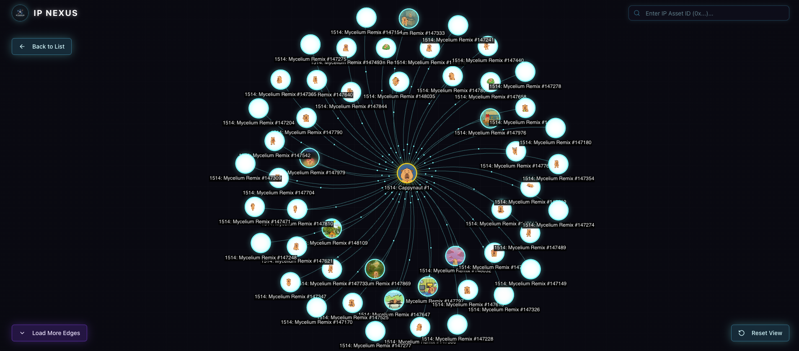

# IP Nexus



**IP Nexus** is a specialized data exploration tool designed to illuminate the complex relationships of Intellectual Property Assets (IP Assets) on the Story Protocol blockchain.

## 🌟 Overview

Upon inputting an IP identifier, the system instantly activates an interactive graph model, vividly visualizing the asset's entire on-chain genealogy. The interface focuses on displaying nodes representing individual IPs and edges illustrating the inheritance relationships (root-to-derivative).

IP Nexus functions as a microscope, enabling users to track the origin, evolution, and licensing terms of digital assets in real-time. By transforming raw, opaque on-chain data into a living network map, the project provides absolute traceability and transparency, serving developers and users who seek a deep understanding of the programmable IP economy.

## ✨ Key Features

- **Interactive Graph Visualization**: Explore IP relationships with a dynamic, force-directed graph (Arkham Intelligence style).
- **Real-time Genealogy**: Trace the lineage of any IP Asset from its root to all its derivatives.
- **Deep Search**: Instantly find IP Assets by ID or address.
- **Visual Clarity**: "Neon Cyberpunk" aesthetic with clear distinction between Root IPs and Derivatives.
- **Performance**: Optimized for handling complex networks with dynamic damping and stabilization.

## 🛠 Tech Stack

- **Framework**: [Next.js 14](https://nextjs.org/) (App Router)
- **Language**: TypeScript
- **Styling**: Tailwind CSS
- **Visualization**: `react-force-graph-2d` / D3.js
- **Blockchain Integration**: Story Protocol SDK (`@story-protocol/core-sdk`)
- **Icons**: Lucide React

## 🚀 Getting Started

First, install the dependencies:

```bash
pnpm install
# or
npm install
```

Then, run the development server:

```bash
pnpm dev
# or
npm run dev
```

Open [http://localhost:3000](http://localhost:3000) with your browser to see the result.

## 📁 Project Structure

- `app/`: Next.js App Router pages and layouts.
- `components/`: Reusable UI components.
  - `viz/`: Graph visualization components (ArkhamGraph).
  - `layout/`: Header, Sidebar, etc.
- `lib/`: Utility functions and API clients.
  - `story-api.ts`: Integration with Story Protocol.
  - `transform-ip-data.ts`: Data transformation logic for the graph.
- `hooks/`: Custom React hooks (e.g., `useIpGraphData`).

## 🤝 Contributing

Contributions are welcome! Please feel free to submit a Pull Request.

## 📄 License

This project is licensed under the MIT License.
